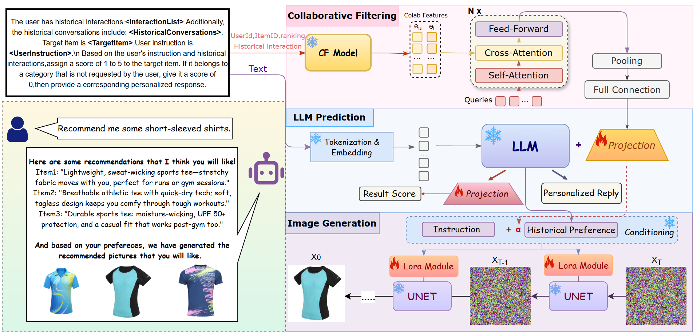

# DiffRec: **Collaborative Fusion with Diffusion-Guided Generation for Personalized Interactive Recommendation**

This repository contains **DiffRec**, an advanced recommendation system that combines collaborative filtering with diffusion-based image generation for personalized visual recommendations.

## Overview

DiffRec revolutionizes personalized recommendation by integrating:
- **Collaborative Filtering**: Traditional user-item interaction modeling with Matrix Factorization and deep collaborative models
- **Multi-Modal LLM**: Large Language Model fine-tuning with LoRA for personalized text generation
- **Diffusion Image Generation**: Stable Diffusion 3.5 with LoRA for generating personalized product images
- **Smart Evaluation**: CLIP-based and multi-modal evaluation for image-text consistency

The system provides end-to-end personalized recommendations with both textual descriptions and generated product images tailored to individual user preferences.





## Features

🎯 **Personalized Recommendations**: Advanced collaborative filtering with user-item interaction modeling  
🎨 **Image Generation**: Stable Diffusion 3.5 with LoRA for personalized product images  
🤖 **Multi-Modal LLM**: Language model fine-tuning for recommendation text generation  
📊 **Smart Evaluation**: CLIP and multi-modal evaluation for image-text consistency  
🧠 **Adaptive Fusion**: Dynamic weight fusion of text instructions and user preferences  
📈 **Training Management**: Smart image saving, cleanup, and training monitoring  

## Getting Started
### Installation

**1. Prepare the code and the environment**

Create a Python environment and activate it:

```bash
conda env create -f environment.yml
conda activate minigpt4
```

**2. Prepare the pretrained models**

- **Vicuna weights**: Please refer to Mini-GPT4's instruction [here](PrepareVicuna.md) to prepare the Vicuna weights.
- **Stable Diffusion 3.5**: Download Stable Diffusion 3.5 Medium model to `/root/autodl-tmp/stable-diffusion-3.5-medium/`
- **CLIP model**: The system will automatically download CLIP ViT-B/32 for evaluation

Set the model paths in your training config file:
```yaml
llama_model: "path/to/vicuna-13b"  # Vicuna model path
sd_base_dir: "/root/autodl-tmp/stable-diffusion-3.5-medium"  # SD3.5 path
```

**3. Prepare the Datasets**

Process your data using the code provided in the `./dataset` directory. The system supports:
- User-item interaction data (ratings, clicks, purchases)
- Item metadata (titles, descriptions, categories)
- Image data for multi-modal training


### Training

**1. Collaborative Pre-training**

First, pre-train a collaborative filtering model for user-item interaction modeling:

```shell
python baseline_train_mf_ood.py
```

**2. Multi-Modal Joint Training**

DiffRec supports joint training of recommendation and image generation. Configure your training parameters in the config file (e.g., [train_configs/plora_pretrain_mf_ood.yaml](train_configs/plora_pretrain_mf_ood.yaml)):

```yaml
# Recommendation settings
freeze_rec: True
freeze_lora: False
prompt_path: "prompts/tallrec_movie.txt"
pretrained_path: "path/to/pretrained/collab/model"

# Image generation settings
sd_base_dir: "/root/autodl-tmp/stable-diffusion-3.5-medium"
sd_lora_weight: "path/to/sd/lora/weights"  # optional
diffusion_lora:
  r: 16
  alpha: 32

# Training settings
ckpt: None
evaluate: False
```

Run the joint training:
```shell
python train_collm_mf_din.py --cfg-path=train_configs/plora_pretrain_mf_ood.yaml
```

**3. Training Features**

- **Smart Image Management**: Automatically saves, organizes, and cleans generated images during training
- **CLIP Evaluation**: Real-time text-image similarity evaluation using CLIP
- **Dual-GPU Support**: Optimized memory management for multi-GPU training
- **LoRA Integration**: Efficient fine-tuning for both LLM and Stable Diffusion
- **Adaptive Weight Fusion**: Dynamic combination of user preferences and item features

### Evaluation

Set the evaluation parameters in your config file:
```yaml
ckpt: "path/to/your/checkpoint"  # trained model path
evaluate: True                   # evaluation mode
```

Run evaluation:
```shell
python train_collm_mf_din.py --cfg-path=train_configs/plora_pretrain_mf_ood.yaml
```

**Evaluation Metrics:**
- **Recommendation**: Traditional metrics (MAE, RMSE) for ranking performance
- **Image Quality**: CLIP similarity scores, consistency, accuracy, integrity, and quality
- **Multi-Modal**: Combined text-image evaluation for personalized content generation

## Architecture

```
DiffRec System Architecture
├── Collaborative Filtering (Matrix Factorization + Deep Models)
├── Multi-Modal LLM (Vicuna + LoRA)
├── Diffusion Image Generation (Stable Diffusion 3.5 + LoRA)
├── CLIP Evaluation (Text-Image Similarity)
└── Smart Training Management (Image Saving & Organization)
```

## Citation

If you're using DiffRec in your research or applications, please cite:
```bibtex
@article{diffrec2025,
      title={DiffRec: Collaborative Fusion with Diffusion-Guided Generation for Personalized Interactive Recommendation}, 
      author={[Xinhui Liu]},
      year={2025},
      journal={[None]}
}
```

*Based on the original CoRA paper:*

```bibtex
@article{liu2024cora,
      title={CoRA: Collaborative Information Perception by Large Language Model's Weights for Recommendation}, 
      author={Yuting Liu and Jinghao Zhang and Yizhou Dang and Yuliang Liang and Qiang Liu and Guibing Guo and Jianzhe Zhao and Xingwei Wang},
      year={2024},
      journal={arXiv preprint arXiv:2408.10645}
}
```

## Acknowledgement

+ **[MiniGPT4](https://github.com/Vision-CAIR/MiniGPT-4)** and **[CoLLM](https://github.com/zyang1580/CoLLM)**: Foundation for multi-modal LLM integration
+ **[Stable Diffusion](https://huggingface.co/stabilityai/stable-diffusion-3.5-medium)**: State-of-the-art diffusion model for image generation
+ **[Vicuna](https://github.com/lm-sys/FastChat)**: Powerful open-source language model
+ **[CLIP](https://github.com/openai/CLIP)**: Multi-modal evaluation and text-image similarity
+ **[diffusers](https://github.com/huggingface/diffusers)**: Diffusion model training and inference library

